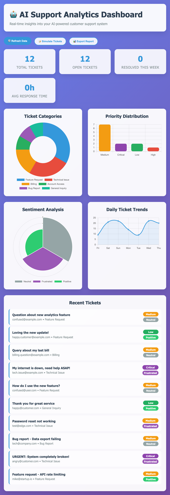

# AI-Powered Support Ticket System

 ## Table of Contents

- [Overview](#overview)
- [Key Features](#key-features)
- [Technologies Used](#technologies-used)
- [Architecture](#architecture)
- [Getting Started](#getting-started)
    - [Prerequisites](#prerequisites)
    - [Project Setup](#project-setup)
    - [Database Setup](#database-setup)
    - [Running the Application](#running-the-application)
    - [Running Tests and Demonstrating AI](#running-tests-and-demonstrating-ai)
    - [Accessing the Dashboard](#accessing-the-dashboard)
- [Future Enhancements](#future-enhancements)
- [Contributing](#contributing)
- [License](#license)
- [Contact](#contact)

---

## Overview

This project implements an **AI-powered Support Ticket System** designed to automate and enhance customer support operations. It leverages Large Language Models (LLMs) for intelligent ticket classification and response generation, combined with PostgreSQL and the `pgvector` extension for efficient semantic search on historical support data.

The system aims to streamline the support process by providing:
* Automated categorization, prioritization, and sentiment analysis of incoming tickets.
* AI-suggested responses to accelerate agent workflows.
* The ability to find similar, previously resolved tickets using vector similarity search.
* A real-time analytics dashboard for operational insights.

---

## Key Features

* **Intelligent Ticket Triage:** Automatically classifies tickets by category (e.g., Technical, Billing), assigns priority (Critical, High, Medium, Low), and determines customer sentiment (Positive, Neutral, Frustrated).
* **AI-Suggested Responses:** Generates context-aware draft responses for new tickets using an LLM, leveraging historical solutions.
* **Semantic Search with `pgvector`:** Stores AI embeddings of tickets in PostgreSQL, enabling efficient search for semantically similar resolved tickets to assist agents.
* **Real-time Analytics Dashboard:** A web-based dashboard visualizes key support metrics, ticket trends, and performance indicators.
* **Scalable Backend:** Flask API serves as the core logic, handling AI interactions and database operations.
* **Modular Design:** Separates frontend, backend, and utility scripts for better maintainability and scalability.

---

## Technologies Used

* **Backend:**
    * Python 3.8+
    * Flask (Web Framework)
    * `psycopg2` (PostgreSQL adapter)
    * `python-dotenv` (Environment variable management)
    * `requests` (for API calls in `test_support.py`)
    * `OpenAI` (for LLM interactions and embeddings) - *Can be replaced with your custom LLM*
    * `Flask-CORS` (for Cross-Origin Resource Sharing)
* **Database:**
    * PostgreSQL
    * `pgvector` Extension (for vector storage and similarity search)
* **Frontend:**
    * HTML5, CSS3, JavaScript
    * `Chart.js` (for data visualization)
* **Development Tools:**
    * Git & GitHub
    * Virtual Environments (`venv`)

---

## Architecture

The project follows a client-server architecture:
# AI-Powered Support Ticket System with pgvector and PostgreSQL

This project implements an intelligent support ticket system leveraging Artificial Intelligence (AI) and the power of PostgreSQL with the `pgvector` extension. It demonstrates how Large Language Models (LLMs) can be integrated directly with your database to automate classification, generate responses, and enable semantic search for customer support tickets.

The system consists of a Flask API backend, a PostgreSQL database with `pgvector` for vector embeddings, and an OpenAI LLM for AI capabilities.

-   **Flask API (`app.py`):** Handles incoming support tickets, interacts with the OpenAI LLM for classification and response generation, stores data in PostgreSQL, and provides endpoints for ticket management and analytics.
-   **PostgreSQL with `pgvector`:** The primary data store for tickets and their associated AI-generated embeddings. `pgvector` enables efficient storage and similarity search for vector data.
-   **OpenAI LLM:** Used for:
    -   Classifying ticket `category`, `priority`, and `sentiment`.
    -   Generating suggested responses for support agents.
    -   Generating embeddings for ticket subjects and messages to enable semantic search.
-   **Analytics Dashboard (`analytics_dashboard.html`):** A simple HTML dashboard to visualize ticket analytics and demonstrate the system's capabilities.
-   **Test Script (`test_support.py`):** Automates the submission of sample tickets and queries to demonstrate the API's functionality.

## Getting Started

These instructions will get you a copy of the project up and running on your local machine for development and testing purposes.

### Prerequisites

Before you begin, ensure you have the following installed:

-   **Python 3.8+**
-   **PostgreSQL** (with `pgvector` extension installed)
    -   If using Docker, a `docker-compose.yml` is provided for easy setup.
-   **An OpenAI API Key**

### Project Setup

1.  **Clone the repository:**
    bash
    git clone [https://github.com/your-github-username/pgvector-AI-tickets.git](https://github.com/your-github-username/pgvector-AI-tickets.git)
    cd pgvector-AI-tickets
    
    *(Remember to replace `your-github-username` with your actual GitHub username once you clone your own repository)*

2.  **Create a Python virtual environment** (recommended):
    bash
    python3 -m venv venv
    source venv/bin/activate # On Windows, use `venv\Scripts\activate`
    

3.  **Install Python dependencies:**
    bash
    pip install -r requirements.txt
    

4.  **Create an `.env` file for AI API Key:**
    Create a file named `ai_env.env` in the root of the project and add your OpenAI API key:
    
    OPENAI_API_KEY="sk-YOUR_OPENAI_API_KEY_HERE"
    
    *(Replace `sk-YOUR_OPENAI_API_KEY_HERE` with your actual OpenAI API Key)*

### Database Setup

You have two options for setting up your PostgreSQL database:

#### Option 1: Using Docker (Recommended for simplicity)

1.  Ensure Docker and Docker Compose are installed on your system.
2.  Navigate to the project root directory where `docker-compose.yml` is located.
3.  Run Docker Compose to start the PostgreSQL container:
    bash
    docker-compose up -d
    
    This will start a PostgreSQL container named `support_ai_db` accessible on port `5432`.
    The `pgvector` extension will be enabled automatically by the `docker-entrypoint-initdb.d/init.sql` script within the container.

#### Option 2: Manual PostgreSQL Setup

1.  **Install PostgreSQL** (if not already installed).
2.  **Create a database:**
    sql
    CREATE DATABASE support_ai_db;
    
3.  **Connect to the database and enable `pgvector`:**
    sql
    \c support_ai_db;
    CREATE EXTENSION vector;
    
    (Ensure you have the `pgvector` extension available for your PostgreSQL installation. You might need to install it separately if it's not present.)

### Running the Application

1.  **Ensure your Python virtual environment is active** (`source venv/bin/activate`).
2.  **Ensure your PostgreSQL database is running** (either via Docker or manually).
3.  **Run the Flask application:**
    bash
    python app.py
    
    The Flask API will start and be accessible at `http://localhost:5001`. The console will print `Database connection successful!` if the connection is established.

### Running Tests and Demonstrating AI

The `test_support.py` script provides a way to interact with the API, submit sample tickets, and demonstrate the AI's classification and response generation capabilities.

1.  **Ensure the Flask application (`app.py`) is running.**
2.  Open a **NEW** terminal window or tab.
3.  **Activate your Python virtual environment** in this new terminal (`source venv/bin/activate`).
4.  Navigate to your project's root directory (`cd pgvector-AI-tickets`).
5.  Run the test script:
    bash
    python test_support.py
    
    This script will:
    -   Check the API health.
    -   Submit several sample support tickets.
    -   Retrieve an individual ticket.
    -   Fetch analytics data.
    -   List tickets with filters.
    -   Demonstrate AI classification and suggested responses for various edge cases.
    -   You will see the output of the AI classifications and responses directly in your terminal.

### Accessing the Dashboard

The `analytics_dashboard.html` file provides a simple browser-based dashboard to visualize ticket data.

1.  **Ensure the Flask application (`app.py`) is running.**
2.  Open the `analytics_dashboard.html` file directly in your web browser. You can usually do this by right-clicking the file and choosing "Open with Browser", or by dragging the file into your browser window.
3.  The dashboard will fetch data from your running Flask API to display charts and ticket lists. You can use the "Simulate New Tickets" button to add more data and see the dashboard update.

## Database Schema

The `init.sql` script (used by Docker Compose) or manual setup would create the `tickets` table with the following schema:

-- Connect to PostgreSQL and create database
CREATE DATABASE support_ai_db;
\c support_ai_db;

-- Enable pgvector extension
CREATE EXTENSION vector;

-- Create support tickets table
CREATE TABLE support_tickets (
    id SERIAL PRIMARY KEY,
    customer_email VARCHAR(255) NOT NULL,
    subject VARCHAR(500) NOT NULL,
    message TEXT NOT NULL,
    category VARCHAR(100),
    priority VARCHAR(20),
    sentiment VARCHAR(20),
    status VARCHAR(50) DEFAULT 'open',
    embedding vector(1536),
    created_at TIMESTAMP DEFAULT CURRENT_TIMESTAMP,
    resolved_at TIMESTAMP,
    resolution_time_hours INTEGER
);

-- Create responses table for AI-generated responses
CREATE TABLE ticket_responses (
    id SERIAL PRIMARY KEY,
    ticket_id INTEGER REFERENCES support_tickets(id),
    response_text TEXT NOT NULL,
    response_type VARCHAR(50), -- 'auto', 'human', 'ai_suggested'
    confidence_score DECIMAL(3,2),
    created_at TIMESTAMP DEFAULT CURRENT_TIMESTAMP
);

-- Create categories lookup table
CREATE TABLE ticket_categories (
    id SERIAL PRIMARY KEY,
    name VARCHAR(100) NOT NULL,
    description TEXT,
    avg_resolution_hours DECIMAL(5,2),
    priority_weight INTEGER DEFAULT 1
);

-- Insert sample categories
INSERT INTO ticket_categories (name, description, avg_resolution_hours, priority_weight) VALUES
('Technical Issue', 'Software bugs, system errors, technical problems', 4.5, 3),
('Billing', 'Payment issues, invoice questions, subscription problems', 2.0, 2),
('Account Access', 'Login problems, password resets, account lockouts', 1.5, 4),
('Feature Request', 'New feature suggestions, enhancement requests', 24.0, 1),
('General Inquiry', 'General questions, information requests', 3.0, 1),
('Bug Report', 'Software bugs and error reports', 8.0, 3),
('Refund Request', 'Refund and cancellation requests', 6.0, 2);

-- Create indexes for better performance
CREATE INDEX ON support_tickets USING ivfflat (embedding vector_cosine_ops);
CREATE INDEX ON support_tickets (category, priority);
CREATE INDEX ON support_tickets (created_at DESC);

Here is the complete README.md content. Please copy this text and save it as README.md (with this exact capitalization, R E A D M E all uppercase) in the main pgvector-AI-tickets folder on your computer.

Markdown

This project implements an intelligent support ticket system leveraging Artificial Intelligence (AI) and the power of PostgreSQL with the `pgvector` extension. It demonstrates how Large Language Models (LLMs) can be integrated directly with your database to automate classification, generate responses, and enable semantic search for customer support tickets.

## Architecture

The system consists of a Flask API backend, a PostgreSQL database with `pgvector` for vector embeddings, and an OpenAI LLM for AI capabilities.

-   **Flask API (`app.py`):** Handles incoming support tickets, interacts with the OpenAI LLM for classification and response generation, stores data in PostgreSQL, and provides endpoints for ticket management and analytics.
-   **PostgreSQL with `pgvector`:** The primary data store for tickets and their associated AI-generated embeddings. `pgvector` enables efficient storage and similarity search for vector data.
-   **OpenAI LLM:** Used for:
    -   Classifying ticket `category`, `priority`, and `sentiment`.
    -   Generating suggested responses for support agents.
    -   Generating embeddings for ticket subjects and messages to enable semantic search.
-   **Analytics Dashboard (`analytics_dashboard.html`):** A simple HTML dashboard to visualize ticket analytics and demonstrate the system's capabilities.
-   **Test Script (`test_support.py`):** Automates the submission of sample tickets and queries to demonstrate the API's functionality.

## Getting Started

These instructions will get you a copy of the project up and running on your local machine for development and testing purposes.

### Prerequisites

Before you begin, ensure you have the following installed:

-   **Python 3.8+**
-   **PostgreSQL** (with `pgvector` extension installed)
    -   If using Docker, a `docker-compose.yml` is provided for easy setup.
-   **An OpenAI API Key**

### Project Setup

1.  **Clone the repository:**
    bash
    git clone [https://github.com/your-github-username/pgvector-AI-tickets.git](https://github.com/your-github-username/pgvector-AI-tickets.git)
    cd pgvector-AI-tickets
    
    *(Remember to replace `your-github-username` with your actual GitHub username once you clone your own repository)*

2.  **Create a Python virtual environment** (recommended):
    bash
    python3 -m venv venv
    source venv/bin/activate # On Windows, use `venv\Scripts\activate`
    

3.  **Install Python dependencies:**
    bash
    pip install -r requirements.txt
    

4.  **Create an `.env` file for AI API Key:**
    Create a file named `ai_env.env` in the root of the project and add your OpenAI API key:
    
    OPENAI_API_KEY="sk-YOUR_OPENAI_API_KEY_HERE"
    
    *(Replace `sk-YOUR_OPENAI_API_KEY_HERE` with your actual OpenAI API Key)*

### Database Setup

You have two options for setting up your PostgreSQL database:

#### Option 1: Using Docker (Recommended for simplicity)

1.  Ensure Docker and Docker Compose are installed on your system.
2.  Navigate to the project root directory where `docker-compose.yml` is located.
3.  Run Docker Compose to start the PostgreSQL container:
    bash
    docker-compose up -d
    
    This will start a PostgreSQL container named `support_ai_db` accessible on port `5432`.
    The `pgvector` extension will be enabled automatically by the `docker-entrypoint-initdb.d/init.sql` script within the container.

#### Option 2: Manual PostgreSQL Setup

1.  **Install PostgreSQL** (if not already installed).
2.  **Create a database:**
    sql
    CREATE DATABASE support_ai_db;
    
3.  **Connect to the database and enable `pgvector`:**
    sql
    \c support_ai_db;
    CREATE EXTENSION vector;
    
    (Ensure you have the `pgvector` extension available for your PostgreSQL installation. You might need to install it separately if it's not present.)

### Running the Application

1.  **Ensure your Python virtual environment is active** (`source venv/bin/activate`).
2.  **Ensure your PostgreSQL database is running** (either via Docker or manually).
3.  **Run the Flask application:**
    bash
    python app.py
    
    The Flask API will start and be accessible at `http://localhost:5001`. The console will print `Database connection successful!` if the connection is established.

### Running Tests and Demonstrating AI

The `test_support.py` script provides a way to interact with the API, submit sample tickets, and demonstrate the AI's classification and response generation capabilities.

1.  **Ensure the Flask application (`app.py`) is running.**
2.  Open a **NEW** terminal window or tab.
3.  **Activate your Python virtual environment** in this new terminal (`source venv/bin/activate`).
4.  Navigate to your project's root directory (`cd pgvector-AI-tickets`).
5.  Run the test script:
    bash
    python test_support.py
    
    This script will:
    -   Check the API health.
    -   Submit several sample support tickets.
    -   Retrieve an individual ticket.
    -   Fetch analytics data.
    -   List tickets with filters.
    -   Demonstrate AI classification and suggested responses for various edge cases.
    -   You will see the output of the AI classifications and responses directly in your terminal.

### Accessing the Dashboard

The `analytics_dashboard.html` file provides a simple browser-based dashboard to visualize ticket data.

1.  **Ensure the Flask application (`app.py`) is running.**
2.  Open the `analytics_dashboard.html` file directly in your web browser. You can usually do this by right-clicking the file and choosing "Open with Browser", or by dragging the file into your browser window.
3.  The dashboard will fetch data from your running Flask API to display charts and ticket lists. You can use the "Simulate New Tickets" button to add more data and see the dashboard update.

## Future Enhancements
Advanced UI: Develop a more sophisticated frontend application (e.g., React, Vue.js) for agents to manage tickets, interact with AI suggestions, and view analytics.

Real-time Updates: Implement WebSockets for real-time ticket updates in the dashboard.

More AI Features:

Automated routing of tickets based on classification.

Integration with knowledge base for automated response generation.

Fine-tuning LLM for domain-specific language.

Authentication & Authorization: Secure API endpoints.

Scalability: Implement caching, load balancing, and potentially a message queue for async tasks.

Monitoring & Logging: Integrate with monitoring tools.

## Contributing
Contributions are welcome! Please feel free to fork the repository, open issues, and submit pull requests.

## License

NA

## Contact

Rajashekar Raju
raj.y.aws@gmail.com
https://github.com/rajashekar-y

